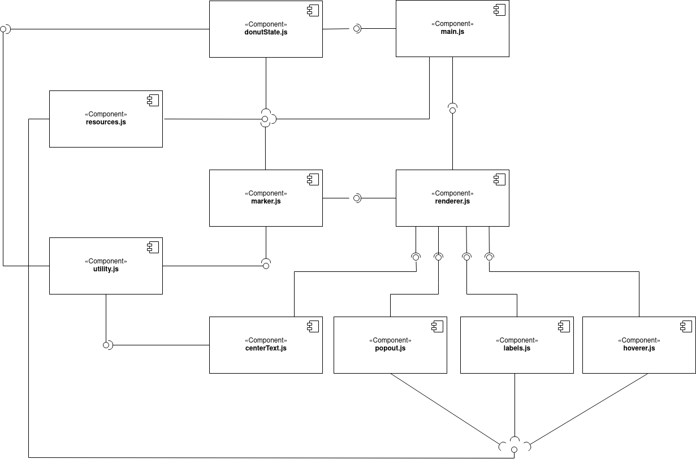

# Donut-Mod Architecture

This document gives a high level overview of the structural and behavioral architectural design of the Donut-Mod

## Architectural drivers

The main architectural driver that is being considered during development is usability. The team wants to make sure that the end-user does not have any major issues while operating the mod. Therefore, the team is looking into other Spotfire mods, their behavior and functionality (in particular the Pie Chart), in order to ensure that the end-user does not get confused; but also that the Donut Chart provides the functionality, behavior and look the end-user expects from a Spotfire Visualization.
## Diagrams

Overview of the system.

### Use Case Diagram

The diagram below showcases the main use cases that are to be implemented in the Donut-Mod.

### System Architecture

The diagram below showcases the basic components of the system on a high level. The diagram excludes the html, css and manifest files used for the mod to run in the Spotfire sandbox environment. The mod utilizes the Tibco Spotfire API from main.js.

