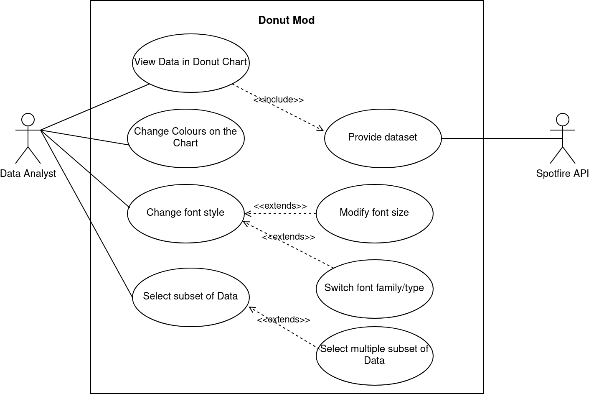

# Donut-Mod Architecture

This document gives a high level overview of the structural and behavioral architectural design of the Donut-Mod

## Architectural drivers

The architectural drivers instrumental for the development of the mod.

## Diagrams

Overview of the system.

### Use Case Diagram

The diagram below showcases the main use cases that are to be implemented in the Donut-Mod.

